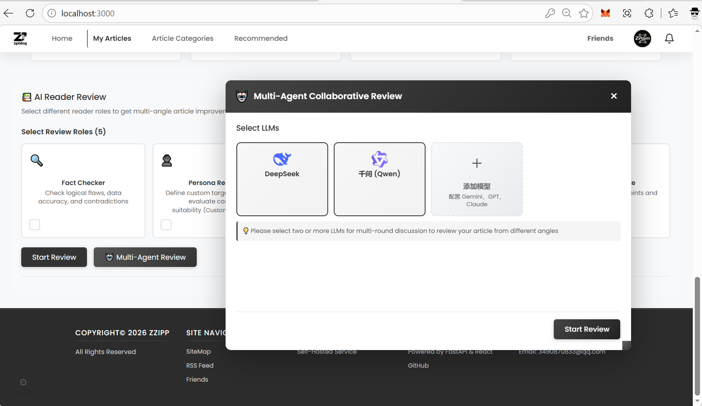
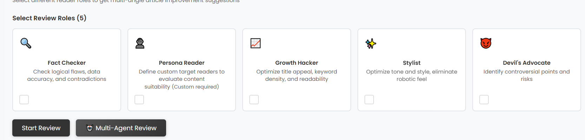

# ZPblog: A Multi-Agent Framework for Intelligent Content Curation

**ZPblog** is a research-oriented, full-stack content ecosystem designed to explore the integration of Large Language Model (LLM) agents within modern web architectures. Unlike traditional CMS solutions that act as passive data repositories, ZPblog implements an active "Editorial Board" environment, utilizing multi-agent collaboration and hybrid recommendation algorithms to solve the challenges of automated quality control and "cold-start" distribution for new creators.

***

## Technical Stack

The project features a decoupled architecture with approximately **25,400** lines of original code, ensuring both industrial-grade stability and research reproducibility.

### Backend (Python)

- **Framework**: FastAPI 0.104.1
- **Persistence**: SQLAlchemy 2.0.23 + MySQL 8.0
- **Validation**: Pydantic V2
- **Task Management**: Native asyncio for non-blocking multi-agent orchestration
- **Security**: JWT + bcrypt for robust session-based authentication

### Frontend (TypeScript)

- **Library**: React 18.2.0 + TypeScript 5.2.2
- **Build Tool**: Vite 5.0.8
- **State Management**: React Context + Custom Hooks
- **Real-time**: WebSocket integration for live AI feedback

***

## Core Innovations

### 1. Multi-Agent Collaborative Review

The system simulates a professional publishing workflow. When an article is submitted, the `multi_agent_review_service.py` triggers an asynchronous discussion among five specialized agents:

- **Content Critic**: Evaluates logical depth and thematic consistency.
- **Grammar Checker**: Handles multi-language syntactical corrections.
- **Style Evaluator**: Analyzes tone, sentiment, and brand alignment.
- **Fact-Checker**: Identifies potential factual inaccuracies.
- **Originality Auditor**: Assesses content uniqueness and innovation.



### 2. Hybrid Recommendation Engine

Located in `ai_recommendation_service.py`, the engine fuses:

- **Collaborative Filtering (CF)**: Mapping user interests based on historical engagement behavior.
- **Semantic Embedding Analysis**: Using LLM-generated embeddings to match content with relevant readers based on topic resonance, effectively bypassing the "zero-traffic" hurdle for new creators.



***

## Project Structure

```text
ZPblog/ 
├── backend/src/app/ 
│   ├── api/            # RESTful route controllers and endpoints 
│   ├── core/           # Security, permissions, and socket.py (WebSockets) 
│   ├── model/          # SQLAlchemy relational models 
│   ├── services/       # Core business logic (Multi-agent, Recommendation, AI Rewrite) 
│   └── alembic/        # Database migration history and schema evolution 
└── frontend/src/ 
    ├── components/     # UI components (MultiAgentReviewPanel, AIRewritePanel) 
    ├── hooks/          # Custom Hooks for AI streaming state management 
    ├── services/       # Typed API wrappers using Axios 
    └── types/          # Global TypeScript interface and type definitions 
```

## Quick Start

### Prerequisites

- Python 3.9+
- Node.js 18+
- MySQL 8.0+

### 1. Backend Setup

```bash
cd backend/src
python -m venv venv
source venv/bin/activate  # Windows: venv\Scripts\activate
pip install -r requirements.txt
cp .env.example .env      # Configure DB credentials and LLM API Keys
uvicorn main:app --reload
```

### 2. Frontend Setup

```bash
cd frontend
npm install
npm run dev
```

## Quality Assurance (QA)

The system includes a robust automated testing suite covering the entire lifecycle of content and AI interactions.

- **Backend**: Executed via pytest with 16 core test cases.
- **Coverage**: JWT security chains, Multi-agent dispatching logic, and Recommendation feedback loops.

```bash
cd backend/src
pytest
```

## Code Statistics

- **Python**: \~8,400 lines
- **TypeScript/TSX**: \~14,500 lines
- **CSS/Styles**: \~2,500 lines
- **Total Original Code**: \~25,400 lines

## License & Author

- **Author**: Junwen Lou
- **Development Period**: Jan 2026 - Mar 2026
- **License**: Apache License 2.0 (LICENSE)
- **Contact**: <junwenlou@gmail.com> | GitHub Issues

